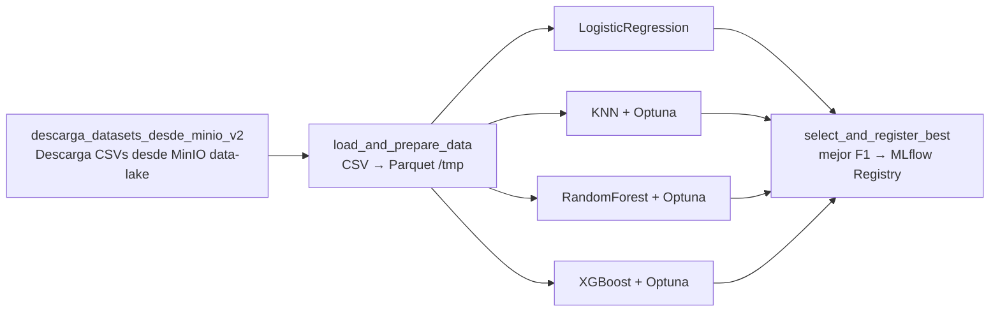

# Arquitectura del sistema

## Diagrama general

Stack completo en la red interna `backend`. Los contenedores se comunican usando el nombre del servicio como hostname.

<svg width="100%" viewBox="0 0 680 580" xmlns="http://www.w3.org/2000/svg" role="img" style="max-width:680px">
<title>Arquitectura del stack MLOps</title>
<desc>Diagrama mostrando FastAPI, JupyterLab, mlflow-proxy, MLflow, MinIO, PostgreSQL y Airflow con CeleryExecutor conectados en la red Docker backend</desc>
<defs>
  <marker id="a" viewBox="0 0 10 10" refX="8" refY="5" markerWidth="6" markerHeight="6" orient="auto-start-reverse">
    <path d="M2 1L8 5L2 9" fill="none" stroke="context-stroke" stroke-width="1.5" stroke-linecap="round" stroke-linejoin="round"/>
  </marker>
</defs>

<!-- Acceso externo -->
<rect x="40" y="40" width="108" height="44" rx="6" fill="#e2e8f0" stroke="#94a3b8" stroke-width="0.5"/>
<text x="94" y="62" text-anchor="middle" font-size="13" font-weight="500" fill="#1e293b" font-family="ui-sans-serif,system-ui,sans-serif">Usuario</text>
<text x="94" y="76" text-anchor="middle" font-size="11" fill="#64748b" font-family="ui-sans-serif,system-ui,sans-serif">externo</text>

<rect x="40" y="104" width="108" height="44" rx="6" fill="#e2e8f0" stroke="#94a3b8" stroke-width="0.5"/>
<text x="94" y="126" text-anchor="middle" font-size="13" font-weight="500" fill="#1e293b" font-family="ui-sans-serif,system-ui,sans-serif">Dev</text>
<text x="94" y="140" text-anchor="middle" font-size="11" fill="#64748b" font-family="ui-sans-serif,system-ui,sans-serif">externo</text>

<!-- FastAPI -->
<rect x="188" y="40" width="140" height="44" rx="6" fill="#d1fae5" stroke="#059669" stroke-width="0.5"/>
<text x="258" y="62" text-anchor="middle" font-size="13" font-weight="500" fill="#065f46" font-family="ui-sans-serif,system-ui,sans-serif">FastAPI</text>
<text x="258" y="76" text-anchor="middle" font-size="11" fill="#047857" font-family="ui-sans-serif,system-ui,sans-serif">serving · :8000</text>

<!-- JupyterLab -->
<rect x="188" y="104" width="140" height="44" rx="6" fill="#dbeafe" stroke="#3b82f6" stroke-width="0.5"/>
<text x="258" y="126" text-anchor="middle" font-size="13" font-weight="500" fill="#1e3a8a" font-family="ui-sans-serif,system-ui,sans-serif">JupyterLab</text>
<text x="258" y="140" text-anchor="middle" font-size="11" fill="#1d4ed8" font-family="ui-sans-serif,system-ui,sans-serif">notebooks · :8888</text>

<!-- mlflow-proxy -->
<rect x="188" y="192" width="140" height="44" rx="6" fill="#fef3c7" stroke="#d97706" stroke-width="0.5"/>
<text x="258" y="214" text-anchor="middle" font-size="13" font-weight="500" fill="#78350f" font-family="ui-sans-serif,system-ui,sans-serif">mlflow-proxy</text>
<text x="258" y="228" text-anchor="middle" font-size="11" fill="#92400e" font-family="ui-sans-serif,system-ui,sans-serif">nginx · :5001</text>

<!-- MLflow -->
<rect x="378" y="148" width="140" height="44" rx="6" fill="#fef3c7" stroke="#d97706" stroke-width="0.5"/>
<text x="448" y="170" text-anchor="middle" font-size="13" font-weight="500" fill="#78350f" font-family="ui-sans-serif,system-ui,sans-serif">MLflow</text>
<text x="448" y="184" text-anchor="middle" font-size="11" fill="#92400e" font-family="ui-sans-serif,system-ui,sans-serif">tracking · :5000</text>

<!-- MinIO -->
<rect x="378" y="212" width="140" height="44" rx="6" fill="#ede9fe" stroke="#7c3aed" stroke-width="0.5"/>
<text x="448" y="234" text-anchor="middle" font-size="13" font-weight="500" fill="#3b0764" font-family="ui-sans-serif,system-ui,sans-serif">MinIO</text>
<text x="448" y="248" text-anchor="middle" font-size="11" fill="#4c1d95" font-family="ui-sans-serif,system-ui,sans-serif">:9000 API · :9001 UI</text>

<!-- PostgreSQL -->
<rect x="378" y="296" width="140" height="44" rx="6" fill="#fee2e2" stroke="#dc2626" stroke-width="0.5"/>
<text x="448" y="318" text-anchor="middle" font-size="13" font-weight="500" fill="#7f1d1d" font-family="ui-sans-serif,system-ui,sans-serif">PostgreSQL</text>
<text x="448" y="332" text-anchor="middle" font-size="11" fill="#991b1b" font-family="ui-sans-serif,system-ui,sans-serif">airflow + mlflow_db</text>

<!-- Airflow box -->
<rect x="40" y="382" width="590" height="168" rx="10" fill="none" stroke="#94a3b8" stroke-width="0.5" stroke-dasharray="6 3"/>
<text x="60" y="402" font-size="11" fill="#64748b" font-family="ui-sans-serif,system-ui,sans-serif">Airflow 3.0 — CeleryExecutor</text>

<rect x="56" y="412" width="106" height="44" rx="6" fill="#d1fae5" stroke="#059669" stroke-width="0.5"/>
<text x="109" y="434" text-anchor="middle" font-size="12" font-weight="500" fill="#065f46" font-family="ui-sans-serif,system-ui,sans-serif">apiserver</text>
<text x="109" y="448" text-anchor="middle" font-size="10" fill="#047857" font-family="ui-sans-serif,system-ui,sans-serif">:8080</text>

<rect x="174" y="412" width="106" height="44" rx="6" fill="#d1fae5" stroke="#059669" stroke-width="0.5"/>
<text x="227" y="434" text-anchor="middle" font-size="12" font-weight="500" fill="#065f46" font-family="ui-sans-serif,system-ui,sans-serif">scheduler</text>
<text x="227" y="448" text-anchor="middle" font-size="10" fill="#047857" font-family="ui-sans-serif,system-ui,sans-serif">DAGs</text>

<rect x="292" y="412" width="106" height="44" rx="6" fill="#d1fae5" stroke="#059669" stroke-width="0.5"/>
<text x="345" y="434" text-anchor="middle" font-size="12" font-weight="500" fill="#065f46" font-family="ui-sans-serif,system-ui,sans-serif">worker</text>
<text x="345" y="448" text-anchor="middle" font-size="10" fill="#047857" font-family="ui-sans-serif,system-ui,sans-serif">Celery</text>

<rect x="410" y="412" width="106" height="44" rx="6" fill="#d1fae5" stroke="#059669" stroke-width="0.5"/>
<text x="463" y="434" text-anchor="middle" font-size="12" font-weight="500" fill="#065f46" font-family="ui-sans-serif,system-ui,sans-serif">triggerer</text>
<text x="463" y="448" text-anchor="middle" font-size="10" fill="#047857" font-family="ui-sans-serif,system-ui,sans-serif">deferred</text>

<rect x="528" y="412" width="90" height="44" rx="6" fill="#d1fae5" stroke="#059669" stroke-width="0.5"/>
<text x="573" y="430" text-anchor="middle" font-size="11" font-weight="500" fill="#065f46" font-family="ui-sans-serif,system-ui,sans-serif">dag-</text>
<text x="573" y="446" text-anchor="middle" font-size="11" font-weight="500" fill="#065f46" font-family="ui-sans-serif,system-ui,sans-serif">processor</text>

<rect x="174" y="474" width="106" height="44" rx="6" fill="#fee2e2" stroke="#dc2626" stroke-width="0.5"/>
<text x="227" y="496" text-anchor="middle" font-size="12" font-weight="500" fill="#7f1d1d" font-family="ui-sans-serif,system-ui,sans-serif">Redis</text>
<text x="227" y="510" text-anchor="middle" font-size="10" fill="#991b1b" font-family="ui-sans-serif,system-ui,sans-serif">broker · :6379</text>

<!-- Arrows -->
<line x1="148" y1="62" x2="186" y2="62" stroke="#059669" stroke-width="1" marker-end="url(#a)"/>
<line x1="148" y1="126" x2="186" y2="126" stroke="#3b82f6" stroke-width="1" marker-end="url(#a)"/>
<path d="M94 148 L94 394 L54 394" fill="none" stroke="#94a3b8" stroke-width="1" stroke-dasharray="4 3" marker-end="url(#a)"/>
<line x1="258" y1="84" x2="258" y2="190" stroke="#d97706" stroke-width="1" marker-end="url(#a)"/>
<line x1="258" y1="148" x2="258" y2="190" stroke="#d97706" stroke-width="1" marker-end="url(#a)"/>
<line x1="328" y1="210" x2="376" y2="185" stroke="#d97706" stroke-width="1" marker-end="url(#a)"/>
<text x="346" y="193" text-anchor="middle" font-size="10" fill="#92400e" font-family="ui-sans-serif,system-ui,sans-serif">Host: localhost</text>
<line x1="448" y1="192" x2="448" y2="210" stroke="#7c3aed" stroke-width="1" marker-end="url(#a)"/>
<text x="540" y="204" text-anchor="start" font-size="10" fill="#4c1d95" font-family="ui-sans-serif,system-ui,sans-serif">artifacts</text>
<line x1="448" y1="256" x2="448" y2="294" stroke="#dc2626" stroke-width="1" marker-end="url(#a)"/>
<text x="540" y="278" text-anchor="start" font-size="10" fill="#991b1b" font-family="ui-sans-serif,system-ui,sans-serif">mlflow_db</text>
<path d="M345 412 L345 352 L258 352 L258 238" fill="none" stroke="#d97706" stroke-width="1" stroke-dasharray="4 3" marker-end="url(#a)"/>
<path d="M463 382 L463 344 L448 344 L448 296" fill="none" stroke="#dc2626" stroke-width="1" stroke-dasharray="4 3" marker-end="url(#a)"/>
<text x="468" y="356" text-anchor="start" font-size="10" fill="#991b1b" font-family="ui-sans-serif,system-ui,sans-serif">airflow_db</text>
<line x1="227" y1="456" x2="227" y2="472" stroke="#dc2626" stroke-width="1" marker-end="url(#a)"/>
<path d="M328 62 L368 62 L368 234 L376 234" fill="none" stroke="#7c3aed" stroke-width="1" stroke-dasharray="4 3" marker-end="url(#a)"/>
<path d="M148 104 L158 104 L158 20 L448 20 L448 146" fill="none" stroke="#94a3b8" stroke-width="0.5" stroke-dasharray="3 3" marker-end="url(#a)"/>
<text x="300" y="14" text-anchor="middle" font-size="10" fill="#94a3b8" font-family="ui-sans-serif,system-ui,sans-serif">:5000 browser directo</text>
<path d="M345 412 L345 358 L448 358 L448 344" fill="none" stroke="#7c3aed" stroke-width="1" stroke-dasharray="4 3" marker-end="url(#a)"/>
</svg>

---

## Flujo de un experimento

<svg width="100%" viewBox="0 0 680 370" xmlns="http://www.w3.org/2000/svg" role="img" style="max-width:680px">
<title>Flujo de un experimento en MLflow</title>
<desc>Diagrama de secuencia mostrando cómo JupyterLab registra un run via mlflow-proxy hacia MLflow y MinIO</desc>
<defs>
  <marker id="a2" viewBox="0 0 10 10" refX="8" refY="5" markerWidth="6" markerHeight="6" orient="auto-start-reverse">
    <path d="M2 1L8 5L2 9" fill="none" stroke="context-stroke" stroke-width="1.5" stroke-linecap="round" stroke-linejoin="round"/>
  </marker>
</defs>

<!-- Headers -->
<rect x="28" y="14" width="120" height="36" rx="6" fill="#dbeafe" stroke="#3b82f6" stroke-width="0.5"/>
<text x="88" y="36" text-anchor="middle" font-size="13" font-weight="500" fill="#1e3a8a" font-family="ui-sans-serif,system-ui,sans-serif">JupyterLab</text>
<line x1="88" y1="50" x2="88" y2="358" stroke="#3b82f6" stroke-width="0.5" stroke-dasharray="4 3"/>

<rect x="188" y="14" width="120" height="36" rx="6" fill="#fef3c7" stroke="#d97706" stroke-width="0.5"/>
<text x="248" y="36" text-anchor="middle" font-size="12" font-weight="500" fill="#78350f" font-family="ui-sans-serif,system-ui,sans-serif">mlflow-proxy</text>
<line x1="248" y1="50" x2="248" y2="358" stroke="#d97706" stroke-width="0.5" stroke-dasharray="4 3"/>

<rect x="348" y="14" width="120" height="36" rx="6" fill="#fef3c7" stroke="#d97706" stroke-width="0.5"/>
<text x="408" y="36" text-anchor="middle" font-size="13" font-weight="500" fill="#78350f" font-family="ui-sans-serif,system-ui,sans-serif">MLflow</text>
<line x1="408" y1="50" x2="408" y2="358" stroke="#d97706" stroke-width="0.5" stroke-dasharray="4 3"/>

<rect x="508" y="14" width="120" height="36" rx="6" fill="#ede9fe" stroke="#7c3aed" stroke-width="0.5"/>
<text x="568" y="36" text-anchor="middle" font-size="13" font-weight="500" fill="#3b0764" font-family="ui-sans-serif,system-ui,sans-serif">MinIO</text>
<line x1="568" y1="50" x2="568" y2="358" stroke="#7c3aed" stroke-width="0.5" stroke-dasharray="4 3"/>

<!-- Step numbers -->
<text x="10" y="78" font-size="10" fill="#94a3b8" font-family="ui-sans-serif,system-ui,sans-serif">1</text>
<text x="10" y="118" font-size="10" fill="#94a3b8" font-family="ui-sans-serif,system-ui,sans-serif">2</text>
<text x="10" y="158" font-size="10" fill="#94a3b8" font-family="ui-sans-serif,system-ui,sans-serif">3</text>
<text x="10" y="198" font-size="10" fill="#94a3b8" font-family="ui-sans-serif,system-ui,sans-serif">4</text>
<text x="10" y="238" font-size="10" fill="#94a3b8" font-family="ui-sans-serif,system-ui,sans-serif">5</text>
<text x="10" y="278" font-size="10" fill="#94a3b8" font-family="ui-sans-serif,system-ui,sans-serif">6</text>
<text x="10" y="318" font-size="10" fill="#94a3b8" font-family="ui-sans-serif,system-ui,sans-serif">7</text>
<text x="10" y="355" font-size="10" fill="#94a3b8" font-family="ui-sans-serif,system-ui,sans-serif">8</text>

<!-- Steps -->
<line x1="88" y1="74" x2="242" y2="74" stroke="#d97706" stroke-width="1" marker-end="url(#a2)"/>
<text x="165" y="68" text-anchor="middle" font-size="10" fill="#92400e" font-family="ui-sans-serif,system-ui,sans-serif">mlflow.start_run()</text>

<line x1="248" y1="110" x2="402" y2="110" stroke="#d97706" stroke-width="1" marker-end="url(#a2)"/>
<text x="325" y="104" text-anchor="middle" font-size="10" fill="#92400e" font-family="ui-sans-serif,system-ui,sans-serif">POST /runs/create · Host: localhost ✅</text>

<line x1="408" y1="148" x2="94" y2="148" stroke="#94a3b8" stroke-width="1" stroke-dasharray="4 2" marker-end="url(#a2)"/>
<text x="250" y="142" text-anchor="middle" font-size="10" fill="#64748b" font-family="ui-sans-serif,system-ui,sans-serif">← run_id</text>

<rect x="50" y="184" width="76" height="24" rx="4" fill="#d1fae5" stroke="#059669" stroke-width="0.5"/>
<text x="88" y="200" text-anchor="middle" font-size="10" fill="#065f46" font-family="ui-sans-serif,system-ui,sans-serif">model.fit()</text>

<line x1="88" y1="230" x2="402" y2="230" stroke="#d97706" stroke-width="1" marker-end="url(#a2)"/>
<text x="245" y="224" text-anchor="middle" font-size="10" fill="#92400e" font-family="ui-sans-serif,system-ui,sans-serif">log_params / log_metrics</text>

<line x1="88" y1="270" x2="402" y2="270" stroke="#d97706" stroke-width="1" marker-end="url(#a2)"/>
<text x="245" y="264" text-anchor="middle" font-size="10" fill="#92400e" font-family="ui-sans-serif,system-ui,sans-serif">mlflow.sklearn.log_model()</text>

<line x1="408" y1="308" x2="562" y2="308" stroke="#7c3aed" stroke-width="1" marker-end="url(#a2)"/>
<text x="485" y="302" text-anchor="middle" font-size="10" fill="#4c1d95" font-family="ui-sans-serif,system-ui,sans-serif">PUT s3://mlflow/&lt;run_id&gt;/model/</text>

<line x1="88" y1="348" x2="562" y2="348" stroke="#7c3aed" stroke-width="1" marker-end="url(#a2)"/>
<text x="325" y="342" text-anchor="middle" font-size="10" fill="#4c1d95" font-family="ui-sans-serif,system-ui,sans-serif">log_feature_columns() → PUT feature_columns.json</text>
</svg>

---

## Flujo de reentrenamiento

Los 4 modelos se entrenan **en paralelo**. Ver [Airflow →](../servicios/airflow.md)
