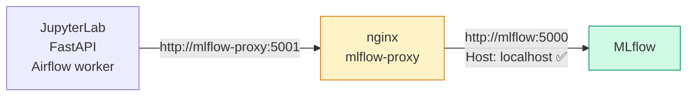

# Workaround: MLflow proxy (nginx)

## El problema

MLflow incluye una protección anti-DNS rebinding que rechaza cualquier request cuyo header `Host` no sea `localhost` o `127.0.0.1`. Esto impide que otros contenedores Docker se conecten directamente:

```
# Esto FALLA desde JupyterLab o Airflow:
MLFLOW_TRACKING_URI=http://mlflow:5000
# MLflow ve Host: mlflow → rechaza con 403
```

## La solución

El contenedor `mlflow-proxy` (nginx) intercepta las requests y **reescribe el header `Host: localhost`** antes de forwardearlas:



## Configuración nginx

```nginx title="nginx/mlflow.conf"
server {
    listen 5001;

    location / {
        proxy_pass         http://mlflow:5000;
        proxy_set_header   Host localhost;
        proxy_set_header   X-Real-IP $remote_addr;
        proxy_set_header   X-Forwarded-For $proxy_add_x_forwarded_for;
    }
}
```

!!! warning "Regla de oro"
    Desde cualquier código Python corriendo dentro de un contenedor, **siempre** usar `http://mlflow-proxy:5001`. La variable de entorno `MLFLOW_TRACKING_URI` ya está configurada en todos los contenedores — no hace falta llamar a `mlflow.set_tracking_uri()` manualmente.

!!! info "Acceso desde el browser"
    El contenedor `mlflow` está expuesto en el puerto `5000` del host. Desde el browser, `http://localhost:5000` funciona sin proxy porque el header `Host` ya es `localhost`.
