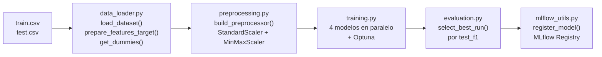

# Dataset & Modelo

## Dataset

**Fuente:** [Airline Passenger Satisfaction — Kaggle](https://www.kaggle.com/datasets/teejmahal20/airline-passenger-satisfaction)

| Archivo | Filas aprox. |
|---------|-------------|
| `datasets/aerolineas/train.csv` | ~103.900 |
| `datasets/aerolineas/test.csv` | ~25.900 |

**Target:** `satisfaction` → `"satisfied"` (1) / `"neutral or dissatisfied"` (0)

**Limpieza:** Se eliminan filas con nulos en `Arrival Delay in Minutes` (~0.3% del dataset) y la columna `id`.

---

## Columnas

=== "Categóricas"

    Se aplica `pd.get_dummies(..., drop_first=True)` en `data_loader.py`:

    | Columna | Valores |
    |---------|---------|
    | `Gender` | `Male`, `Female` |
    | `Customer Type` | `Loyal Customer`, `disloyal Customer` |
    | `Type of Travel` | `Business travel`, `Personal Travel` |
    | `Class` | `Business`, `Eco`, `Eco Plus` |

=== "Numéricas"

    `StandardScaler` en el `ColumnTransformer`:

    | Columna | Descripción |
    |---------|-------------|
    | `Age` | Edad del pasajero |
    | `Flight Distance` | Distancia en millas |
    | `Departure Delay in Minutes` | Retraso de salida |
    | `Arrival Delay in Minutes` | Retraso de llegada |

=== "Ratings (0–5)"

    `MinMaxScaler` en el `ColumnTransformer`:

    | Columna |
    |---------|
    | `Inflight wifi service` |
    | `Departure/Arrival time convenient` |
    | `Ease of Online booking` |
    | `Gate location` |
    | `Food and drink` |
    | `Online boarding` |
    | `Seat comfort` |
    | `Inflight entertainment` |
    | `On-board service` |
    | `Leg room service` |
    | `Baggage handling` |
    | `Checkin service` |
    | `Inflight service` |
    | `Cleanliness` |

---

## Pipeline de entrenamiento



---

## Preprocessing

```python title="src/preprocessing.py — build_preprocessor()"
def build_preprocessor(numeric_cols, rating_cols) -> ColumnTransformer:
    return ColumnTransformer([
        ("scaler", StandardScaler(), numeric_cols),   # Age, Distance, Delays
        ("minmax", MinMaxScaler(), rating_cols),       # 14 ratings (0-5)
    ])
```

!!! note "KNN vs árboles"
    KNN aplica el preprocessor **antes** de Optuna (sensible a escala).
    RandomForest y XGBoost no aplican scaling (los árboles son invariantes a la escala).
    LogisticRegression incluye el preprocessor dentro de un `Pipeline` de sklearn.

---

## Selección del mejor modelo

```python title="src/evaluation.py — select_best_run()"
def select_best_run(results: list[dict]) -> dict:
    return max(results, key=lambda r: r["f1_score"])
```

La métrica de selección es el **F1 score sobre el test set** (`test_f1`). El modelo ganador se registra en el MLflow Model Registry como `airline-satisfaction-best`.
