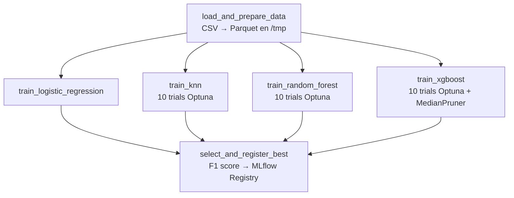

# Airflow — Orquestación

Airflow 3.0 con **CeleryExecutor**. Las tasks se distribuyen a workers via Redis.

## Acceso

```
http://localhost:8080
Usuario: airflow / Password: airflow
```

---

## DAGs disponibles

| DAG | `dag_id` | Schedule | Descripción |
|-----|----------|----------|-------------|
| Ingesta | `descarga_datasets_desde_minio_v2` | Manual | Descarga CSVs desde MinIO `data-lake` al disco |
| Entrenamiento | `airline_satisfaction_training` | Manual | Entrena 4 modelos en paralelo, registra el mejor |

!!! info "Orden de ejecución"
    Primero correr `descarga_datasets_desde_minio_v2` para que los CSVs estén disponibles en `/opt/airflow/datasets/aerolineas/`. Después correr `airline_satisfaction_training`.

---

## DAG 1: `descarga_datasets_desde_minio_v2`

Archivo: `airflow/dags/import_and_process.py`

Descarga `train.csv` y `test.csv` desde el bucket `data-lake` de MinIO hacia el disco del worker.

```python
BUCKET_NAME  = "data-lake"
ARCHIVOS_S3  = ["aerolineas/train.csv", "aerolineas/test.csv"]
RUTA_DESTINO = "/opt/airflow/datasets/aerolineas"
```

**Task:** `tarea_descarga_minio` — usa boto3 con las variables de entorno `S3_ENDPOINT_URL`, `S3_ACCESS_KEY` y `S3_SECRET_KEY`.

---

## DAG 2: `airline_satisfaction_training`

Archivo: `airflow/dags/airline_satisfaction_dag.py`

Entrena 4 modelos en paralelo con Optuna y registra el mejor en MLflow Registry.

### Grafo de tareas



Los 4 tasks de entrenamiento corren **en paralelo** (CeleryExecutor).

### Configuración

| Parámetro | Valor |
|-----------|-------|
| `N_TRIALS` | 10 trials de Optuna por modelo |
| `retries` | 1 (delay: 5 min) |
| `dagrun_timeout` | 120 minutos |

### Detalle de cada task

=== "load_and_prepare_data"

    Carga los CSVs, aplica `prepare_features_target()` y serializa los splits como **Parquet en `/tmp`** para que los tasks de entrenamiento los lean sin re-procesar.

    Retorna: `{"data_dir": "/tmp/airline_sat_<uuid>/"}`

=== "train_logistic_regression"

    `LogisticRegressionCV` con `cv=10`, `max_iter=1000`. Usa `mlflow.sklearn.autolog()`. **Sin Optuna** (CV interno). El preprocessor va dentro de un `Pipeline` de sklearn.

=== "train_knn"

    KNN **requiere scaling** → aplica el preprocessor antes de Optuna. Hiperparámetros buscados:

    | Parámetro | Rango |
    |-----------|-------|
    | `n_neighbors` | 1–50 |
    | `weights` | `uniform` / `distance` |
    | `p` | 1–2 |

=== "train_random_forest"

    Random Forest **no requiere scaling**. Hiperparámetros buscados:

    | Parámetro | Rango |
    |-----------|-------|
    | `n_estimators` | 50–400 |
    | `criterion` | `gini` / `entropy` |
    | `max_depth` | 3–30 |
    | `min_samples_split` | 2–20 |
    | `min_samples_leaf` | 1–20 |

=== "train_xgboost"

    Optuna con `MedianPruner` + early stopping (split interno 80/20). Hiperparámetros buscados:

    | Parámetro | Rango |
    |-----------|-------|
    | `n_estimators` | 50–400 |
    | `max_depth` | 2–10 |
    | `grow_policy` | `depthwise` / `lossguide` |
    | `learning_rate` | 1e-4 – 1.0 (log) |
    | `gamma` | 1e-8 – 1.0 (log) |
    | `min_child_weight` | 1–10 |
    | `subsample` | 0.5–1.0 |
    | `colsample_bytree` | 0.5–1.0 |
    | `reg_alpha` | 1e-8 – 1.0 (log) |
    | `reg_lambda` | 1e-8 – 1.0 (log) |

=== "select_and_register_best"

    Recibe los 4 resultados, los ordena por `f1_score` e imprime la tabla en los logs:

    ```
    Modelo                    F1
    -----------------------------------
    xgboost                   0.9543
    random_forest             0.9421
    knn                       0.9102
    logistic_regression       0.8876
    ```

    Registra el ganador en `airline-satisfaction-best` vía `register_best_model()`.

---

## Triggerear los DAGs

=== "Desde la UI"
    **DAGs** → seleccionar DAG → click en ▶

=== "CLI"
    ```bash
    docker exec airflow_apiserver \
      airflow dags trigger airline_satisfaction_training
    ```

=== "API REST"
    ```bash
    curl -X POST http://localhost:8080/api/v2/dags/airline_satisfaction_training/dagRuns \
      -H "Content-Type: application/json" \
      -u airflow:airflow \
      -d '{}'
    ```

---

## Secrets y Variables

Configurados en `airflow/secrets/` — sin reiniciar:

```yaml title="airflow/secrets/variables.yaml"
mlflow_tracking_uri: "http://mlflow-proxy:5001"
mlflow_experiment_name: "airline-satisfaction"
registered_model_name: "airline-satisfaction-best"
```

```yaml title="airflow/secrets/connections.yaml"
minio_conn:
  conn_type: aws
  login: ${MINIO_ACCESS_KEY}
  password: ${MINIO_SECRET_ACCESS_KEY}
  extra:
    endpoint_url: "http://minio:9000"
    region_name: "us-east-1"
```
