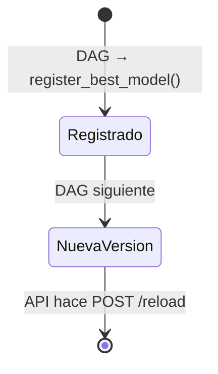

# MLflow — Tracking & Model Registry

## Configuración

| Backend | Tecnología | Qué guarda |
|---------|-----------|-----------|
| **Backend store** | PostgreSQL (`mlflow_db`) | Runs, parámetros, métricas, tags |
| **Artifact store** | MinIO (`s3://mlflow/`) | Modelos, `feature_columns.json` |

## Acceso

```
http://localhost:5000
```

!!! warning "Desde código Python"
    Nunca usar `http://mlflow:5000` directamente. Siempre usar el proxy:
    `MLFLOW_TRACKING_URI=http://mlflow-proxy:5001`
    Ver [workaround →](../arquitectura/mlflow-proxy.md)

---

## Experimento y modelo registrado

| Constante (`src/config.py`) | Valor |
|-----------------------------|-------|
| `EXPERIMENT_NAME` | `"airline-satisfaction"` |
| `REGISTERED_MODEL_NAME` | `"airline-satisfaction-best"` |

---

## Variables de Airflow

Las variables de MLflow se configuran en `airflow/secrets/variables.yaml` y son accesibles desde los DAGs:

```yaml title="airflow/secrets/variables.yaml"
mlflow_tracking_uri: "http://mlflow-proxy:5001"
mlflow_experiment_name: "airline-satisfaction"
registered_model_name: "airline-satisfaction-best"
```

---

## Estructura de runs

Cada ejecución del DAG genera **4 runs padre** con **runs anidados** por trial de Optuna:

```
Experimento: airline-satisfaction
├── Run: LogisticRegression
│   └── (autolog: params + model)
├── Run: KNN
│   ├── Run: trial_0  → f1_cv, n_neighbors, weights, p
│   └── ... (N_TRIALS runs)
├── Run: RandomForest
│   ├── Run: trial_0  → f1_cv, n_estimators, max_depth...
│   └── ...
└── Run: XGBoost
    ├── Run: trial_0  → f1_cv, learning_rate, gamma...
    └── ...
```

Métricas registradas por run padre:

| Métrica | Descripción |
|---------|-------------|
| `best_f1` | Mejor F1 de Optuna (sobre validación cruzada) |
| `test_f1` | F1 sobre el test set con el mejor modelo |
| `f1_cv` | F1 de cada trial (en runs anidados) |

---

## Artefacto `feature_columns.json`

Cada run guarda la lista exacta de columnas post-`get_dummies`. La API lo descarga al cargar el modelo para garantizar consistencia:

```python title="src/mlflow_utils.py — log_feature_columns()"
def log_feature_columns(columns: list[str]) -> None:
    with tempfile.TemporaryDirectory() as tmp:
        path = os.path.join(tmp, "feature_columns.json")
        with open(path, "w") as f:
            json.dump(columns, f)
        mlflow.log_artifact(path)
```

---

## Ciclo de vida del modelo



La API siempre toma la versión con el número más alto — no requiere promotion manual a `Production`.
