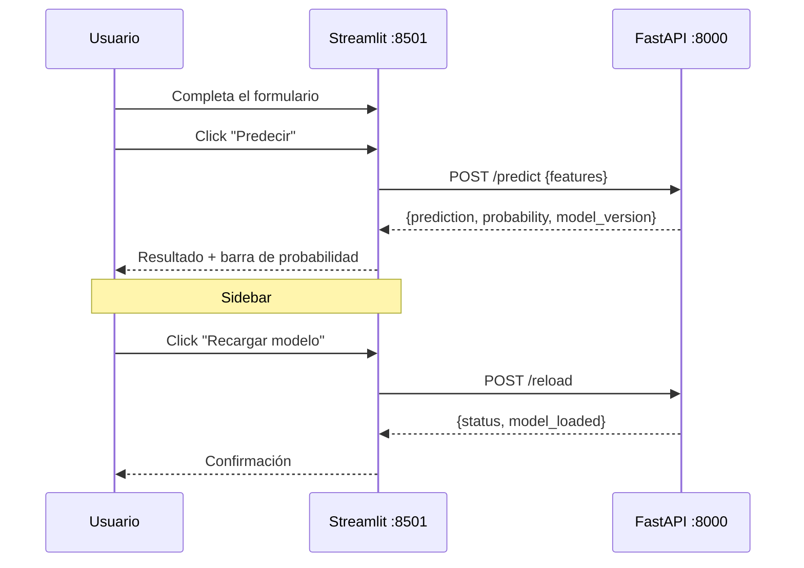

# Streamlit — Frontend de predicción

Interfaz web para interactuar con el modelo sin necesidad de usar curl o Swagger. Consume la FastAPI internamente.

## Acceso

```
http://localhost:8501
```

---

## ¿Qué hace?

- Formulario con los 22 campos del pasajero organizados en 3 columnas
- Botón **Predecir** que llama a `POST /api:8000/predict`
- Resultado con el label (`satisfied` / `neutral or dissatisfied`) y la probabilidad en una barra visual
- Sidebar con el estado de la API y botón para **recargar el modelo** (`POST /reload`) sin reiniciar contenedores
- Checkbox **Cargar ejemplo** para pre-llenar el formulario con valores de prueba
- Expanders con el payload enviado y la respuesta raw de la API

---

## Configuración

```python title="streamlit/streamlit_app.py"
API_BASE_URL = os.getenv("API_BASE_URL", "http://localhost:8000")
```

Dentro de Docker, la variable de entorno `API_BASE_URL=http://api:8000` apunta directamente al contenedor de FastAPI por la red interna `backend`.

```toml title="streamlit/.streamlit/config.toml"
[theme]
base = "dark"
primaryColor = "#2563eb"
backgroundColor = "#0f172a"
secondaryBackgroundColor = "#111827"
textColor = "#f8fafc"
```

---

## Dependencias

```
streamlit
requests
```

---

## Agregar paquetes

```bash
# 1. Editar dockerfiles/streamlit/requirements.txt
# 2. Reconstruir:
docker compose build streamlit
docker compose up -d streamlit
```

---

## Flujo de uso



!!! warning "Requiere modelo entrenado"
    Si la FastAPI no tiene un modelo cargado (porque el DAG todavía no corrió), Streamlit muestra el warning `"API disponible pero sin modelo cargado"` en el sidebar y la predicción falla. Correr primero el DAG `airline_satisfaction_training` en Airflow.
